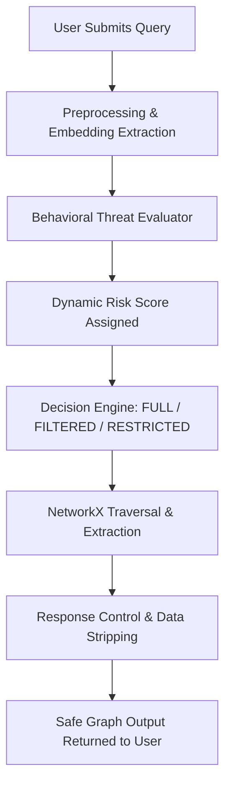

# Beginner's Guide: AegisGraph Privacy-Aware Security System

This detailed guide explains the **AegisGraph Framework** in simple language so you can understand its Next.js frontend, FastAPI backend, NetworkX graph queries, and behavioral threat-monitoring algorithms.

---

## 💡 1. What This Project Is

AegisGraph is a **privacy-aware knowledge security platform**. 

It acts as an intelligent firewall for databases. Instead of giving users unrestricted access to search data, AegisGraph monitors their behavior, scores their risk score, and automatically redacts or blocks search results if it thinks the user is trying to exfiltrate secret files or maps.

---

## ❓ 2. The Problem It Solves

Modern companies keep their knowledge structured in *Knowledge Graphs*. These databases show how employees, projects, passwords, and servers relate. 

However, insider threats or compromised accounts can use "database probing" techniques—asking repeated, slightly modified questions to mapping out high-security credentials.

**AegisGraph solves database exfiltration:**
* It screens every incoming query for behavioral risk.
* If a user asks too many rapid-fire questions, repeats sensitive terms, or tries to semantic-probe relationships, their risk score goes from **LOW** to **MEDIUM** or **HIGH**.
* Depending on risk level, it automatically redacts confidential data fields or restricts their access entirely.

---

## 🏗️ 3. Project Architecture & Tech Stack

AegisGraph uses a two-tier full-stack architecture:

```
AegisGraph-MP1-Demo-main/
├── api.py                  # FastAPI server containing all security REST endpoints
├── data_loader.py          # Loads relational CSV lists into NetworkX graph objects
├── graph_query.py          # Executes secure, traversal-restricted graph queries
├── preprocessing.py        # Cleans query text and extracts semantic embeddings
├── behavior_analysis.py    # Analyzes query frequency, similarity, and probing flags
├── risk_scoring.py         # Dynamic numerical threat evaluator
├── decision_engine.py      # Maps numerical risk to FULL, FILTERED, or RESTRICTED modes
├── response_control.py     # Strips out or hides high-security text nodes
├── logger.py               # SQLite logger logging query histories safely
├── graph_data.csv          # Relational knowledge graph mock data
├── requirements.txt        # Python dependency manifest
└── frontend/               # User interface (Next.js Application):
    ├── app/
    │   ├── globals.css     # CSS variable definitions and dark/light themes
    │   ├── layout.tsx      # Root application layout
    │   └── page.tsx        # Protected dashboard interface (Logs & Profile charts)
    ├── components/
    │   ├── AuthCard.tsx    # Firebase authentication visual elements
    │   ├── LightLines.tsx  # Dynamic moving line canvas decoration
    │   └── ThemeToggle.tsx # Sun/Moon light/dark toggle switcher
    └── lib/
        ├── firebase.ts     # Firebase auth core configuration
        └── api.ts          # Front-to-back API communication module
```

### The Query Protection Flow



1. **Preprocessing (`preprocessing.py`):** Converts the query into numerical vectors (embeddings) using `sentence-transformers` (`all-MiniLM-L6-v2`).
2. **Behavioral Analysis (`behavior_analysis.py`):** Checks if the query semantic-matches previous queries (similarity check) and monitors query submission speed (frequency check).
3. **Risk & Decision Engine (`risk_scoring.py` & `decision_engine.py`):** Evaluates risk levels:
   * 🟢 **LOW Risk**: Output returned fully (**FULL** mode).
   * 🟡 **MEDIUM Risk**: Confidential fields are stripped (**FILTERED** mode).
   * 🔴 **HIGH Risk**: The query is blocked and a warning is triggered (**RESTRICTED** mode).
4. **Graph Database (`graph_query.py`):** Traverses the database safely using **NetworkX**.
5. **Next.js Dashboard (`frontend/`):** Visualizes security logs, threat parameters, and active risk curves in a split-screen dark/light mode interface.

---

## 🚀 4. How to Run AegisGraph

### 1. Run the Security Backend
1. Open your terminal in the AegisGraph project directory:
   ```powershell
   cd "c:\Projects\AegisGraph-MP1-Demo-main\AegisGraph-MP1-Demo-main"
   ```
2. Activate your virtual environment and launch Uvicorn:
   ```powershell
   python api.py
   ```
   *The backend will boot up at `http://localhost:8000`.*

### 2. Run the Next.js Frontend
1. In a new terminal tab, navigate to the frontend:
   ```powershell
   cd frontend
   ```
2. Install npm packages and start the node server:
   ```bash
   npm install
   npm run dev
   ```
3. Open `http://localhost:3000` to interact with the protected Next.js platform!
